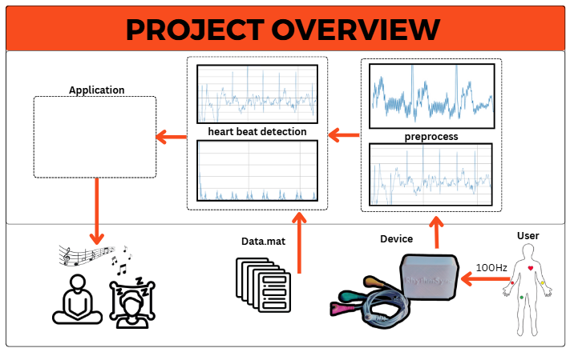

# RhythmSync

**RhythmSync** is an innovative application designed to process real-time Electrocardiogram (ECG) data, detect heart rate peaks, and synchronize auditory feedback based on the detected heart rate. This project combines hardware and software components to provide a seamless experience in monitoring and analyzing heart rhythms.

---

## 🚀 Features

- **Real-Time ECG Data Acquisition**: Captures live ECG signals using connected hardware.
- **Heart Rate Detection**: Processes ECG data to identify heart rate peaks accurately.
- **Auditory Feedback Synchronization**: Plays audio files corresponding to different heart rate zones (e.g., low, medium, high).
- **Data Visualization**: Displays real-time ECG signals and detected peaks for analysis.

---

## 🔧 Hardware Requirements

- **ECG Sensor**: For capturing heart signals.
- **Arduino Board**: Facilitates communication between the ECG sensor and the application.
- **Connecting Cables**: To interface the hardware components.

---

## 🧳 Software Components

- **Python**: Core programming language for data processing and application logic.
- **PySerial**: Handles serial communication between the Arduino and the application.
- **Matplotlib**: Visualizes real-time ECG data.
- **SciPy**: Processes signals and detects peaks.
- **Pygame**: Manages audio playback for auditory feedback.

---

## 🔧 Usage

1. **Connect Hardware**: Set up the ECG sensor and Arduino as per the hardware specifications.
2. **Configure Serial Port**: Update the serial port settings in `hardware_code/main.py` to match your system's configuration:
   ```python
   ser = serial.Serial('COM14', 115200, timeout=1)  # Replace 'COM14' with your port
   ```
3. **Run the Application**:
   ```bash
   python hardware_code/main.py
   ```
4. **Monitor Output**: Observe real-time ECG data and listen to auditory feedback corresponding to your heart rate.

---

## 🎨 Visuals


*Project Overview.*


*Detected heart rate peaks.*

---

*Experience real-time heart rhythm synchronization with RhythmSync.* 🎶
